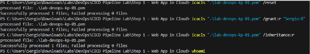
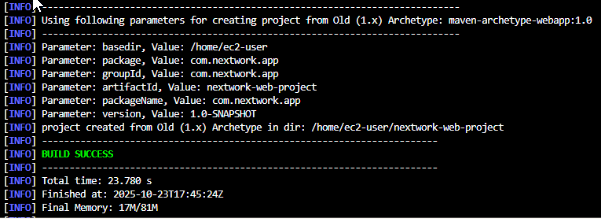
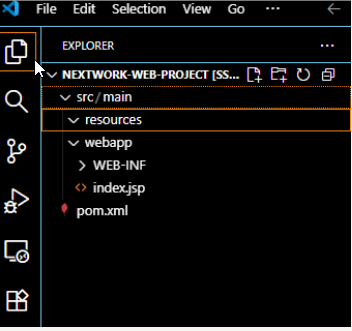

This project demonstrates setting up a **Web App on AWS EC2** as part of a CI/CD pipeline lab.

---

## Steps I Followed

<!-- Steps 1 & 2 as two columns -->
<table>
<tr>
<td>

### 1. Launching an EC2 Instance
- Created an **EC2 instance** to host the Web Application.  
- Enabled **SSH** for secure connection.  
- Created a **key pair**, which AWS downloaded as a `.PEM` file.  

</td>
<td>

### 2. Setting Up VS Code
- Installed **VS Code** to use terminal and connect to the EC2 instance.  
- Installed **Remote - SSH** extension to interact with EC2.  

</td>
</tr>
</table>

---

### 1. Terminal Commands

**Navigate to the directory containing your key:**

```bash
cd path/to/key
````

**Update key permissions (Windows example):**

```bash
icacls your-key.pem /inheritance:r
icacls your-key.pem /grant:r YourUsername:F
```



---

### 2. SSH Connection to EC2

**Connect to EC2 using:**

```bash
ssh -i your-key.pem ec2-user@<EC2_PUBLIC_IPV4>
```


---

### 3. Java & Maven

* Installed **Java** (required for Maven).
* Installed **Apache Maven** to generate and organize Java projects.

---

### 4. Create the Web Application

**Generate a Java web app using Maven:**

```bash
mvn archetype:generate
```



**Open the project with Remote - SSH in VS Code.**

**Configuration details for Remote-SSH:**

```
Host: <host-name>
HostName: <EC2_PUBLIC_IPV4>
IdentityFile: <path-to-your-key.pem>
User: ec2-user
```

**Project folders created by Maven:**

* `src/` → source code
* `webapp/` → HTML, JSP, CSS, JS, and config files



**Edited `index.jsp` to update the placeholder name.**


---

### 5. Project Reflection

* Editing code using VS Code extensions on EC2 was surprisingly easy.
* Key-pair setup was the most challenging.
* Seeing everything connected at the end was the most rewarding.
* Time spent: ~1 hour

```

