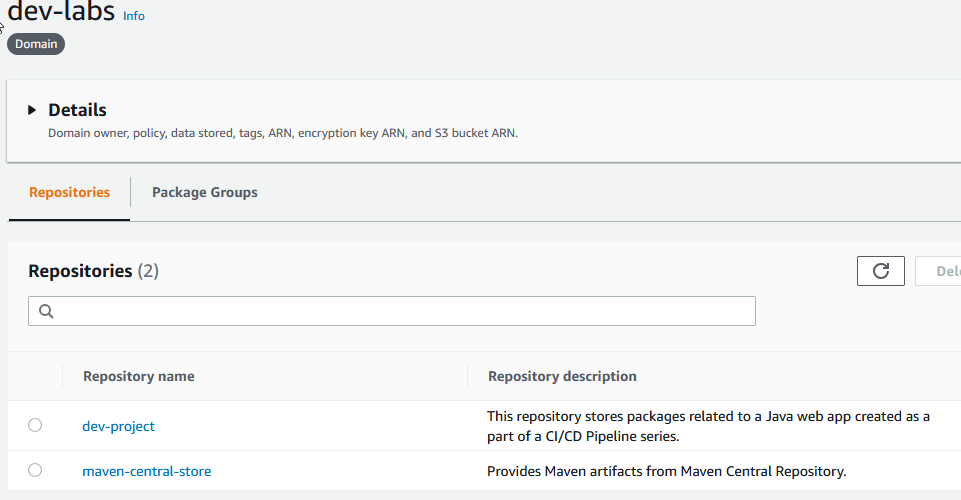
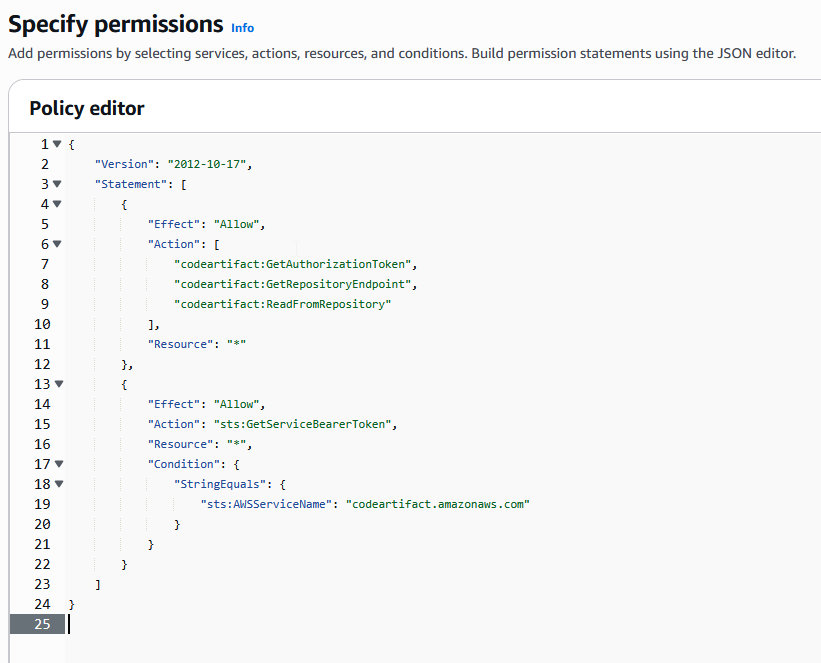
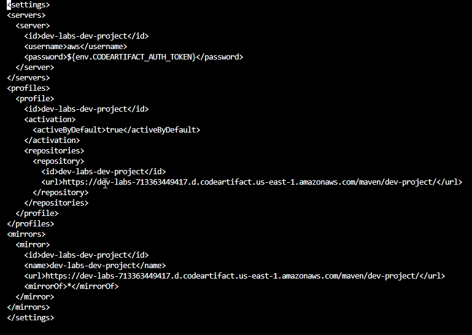
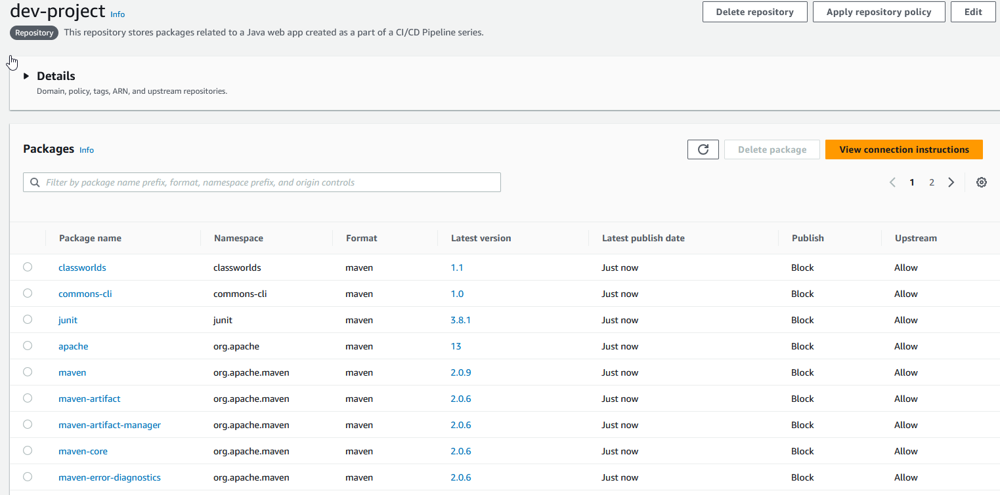

This project demonstrates setting up a **CodeArtifact repository on AWS** as part of a CI/CD pipeline lab.

---

## Steps I Followed

<!-- Steps 1 & 2 as two columns -->
<table>
<tr>
<td>

### 1. Introducing Today's Project
- This project demonstrates how to setup CodeArtifact as a repository for my project's dependencies.  
- Use IAM roles and policies to give my web app access to CodeArtifact.  
- Verify my web app's connection to CodeArtifact.

</td>
<td>

### 2. Key Tools and Concepts
- Key concepts I learnt include setting up the AWS Artifact repo.  
- Creating an IAM policy and attaching it.  
- Pushing my packages into Artifact.  

</td>
</tr>
</table>

---

### 1. CodeArtifact Repository

- CodeArtifact is a secure, central place to store all software packages.  
- Engineering teams use artifact repositories because they are secure, reliable, and give full control.  
- Using **domains** provides a single place to manage permissions and security settings for all repositories. My domain: `dev-labs`.  
- A CodeArtifact repository can have an **upstream repository**, which acts like backup libraries when the primary repo doesn’t have what is needed. My upstream repository: Maven.



---

### 2. CodeArtifact Security

**Issue:**  
- To access CodeArtifact, EC2/Maven must be linked with AWS.  
- Error occurred when retrieving a token because authentication was missing.

**Resolution:**  
- Created a specific **IAM role** with permissions to access CodeArtifact.  
- Using IAM roles is security best practice because explicit access can be granted.

---

### 3. IAM JSON Policy

- JSON policy attached to the IAM role:  
  - Permissions to **get auth tokens**, **find repo locations**, and **read packages**.  
  - Allows temporary elevated access specifically for CodeArtifact.

```json
{
  "Version": "2012-10-17",
  "Statement": [
    {
      "Effect": "Allow",
      "Action": [
        "codeartifact:GetAuthorizationToken",
        "codeartifact:GetRepositoryEndpoint",
        "codeartifact:ReadFromRepository"
      ],
      "Resource": "*"
    }
  ]
}
````



---

### 4. Maven and CodeArtifact

* Compiled web app using **settings.xml**.
* `settings.xml` configures Maven to authenticate to the correct Artifact repo.
* Compiling translates code into a runnable format.



---

### 5. Verify Connection

* Checked `dev-project` Artifact repository after compiling.
* Verified all packages were pushed successfully.



### 6. Project Reflection

Practiced Bash, IAM Policies, CodeArtifact Deployment, Git, and GitHub workflow.

Free-tier EC2 slowness fixed after remapping memory (Free Tier).

Most rewarding: see CodeArtifact sync on the push.

Time spent: ~50 minutes.

```

